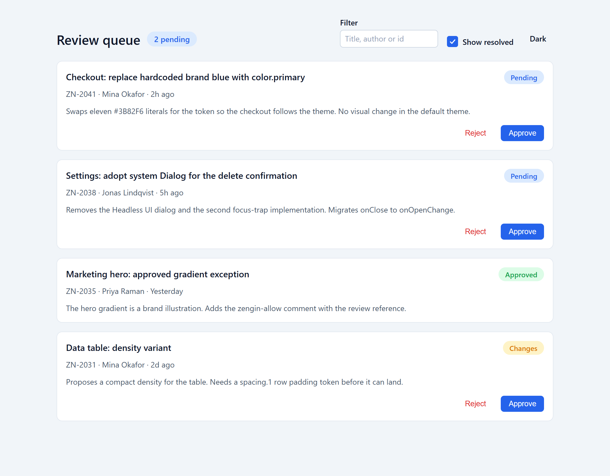
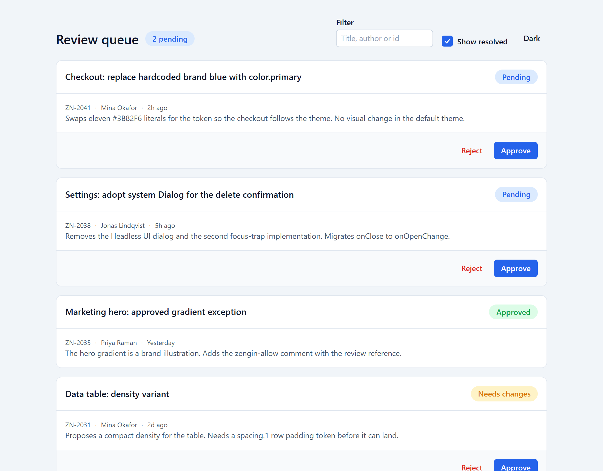
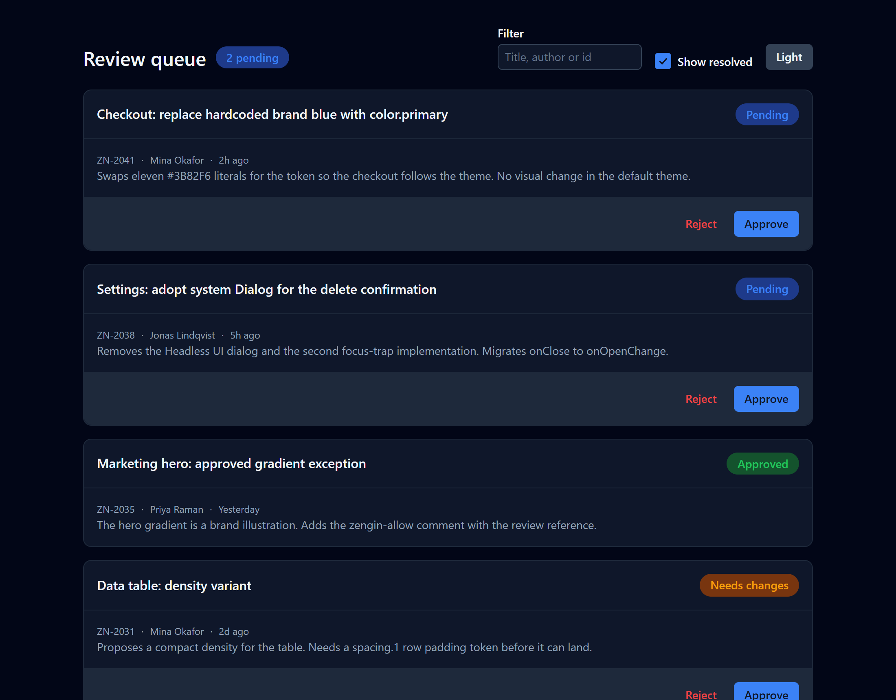

# The enforcement loop, replayed

This is the Phase 1 milestone from the product vision: an agent generates a component off-system, the engine returns violations, the agent self-corrects, and the result renders on-system. It runs as a script, so it is proven on every push rather than recorded once.

```bash
pnpm build                      # from the repository root
pnpm --filter review-workspace demo         # replay with the engine's real output
pnpm --filter review-workspace test         # the same, asserting before > 0 and after = 0
node examples/review-workspace/demo/screenshot.mjs   # renders before and after in headless Chrome
```

The captured output of the last replay is in [`demo/transcript.md`](demo/transcript.md).

## 1. What the agent wrote

`demo/before/ReviewCard.tsx` and `demo/before/review-card.css` are the component the way an agent writes it from a screenshot and a components directory. Every color in it is the correct value in the default theme. The buttons are hand-rolled `<button>` elements. The status badge is a `<span>` with inline colors.

It renders like this:



A screenshot review passes it. That is the problem the engine exists for.

## 2. What the engine said

```
$ zengin check
```

19 violations across the two files: 9 spacing literals, 8 color literals, and 2 raw buttons styled as the system Button. Every color literal came back with an exact fix, because the values matched tokens. `white` came back with six candidates and a note to pick by role, because six tokens are white. `13px` came back as nearest with the two neighbouring scale steps in the note. Each raw button came back with the `Button` element that replaces it and the import to add.

The full output is in the transcript. This is the part an agent acts on:

```
src/ReviewCard.tsx
  32:27  error  spacing-literal  Arbitrary spacing value in inline style (margin). 8px is not on the spacing scale.
         found  margin: "8px 0 12px"
         fix (exact)  "var(--spacing-2) 0 var(--spacing-3)"
  38:11  error  component-substitution  Raw <button> styled as a system Button (background-color, border-radius, color, font, padding). Use Button from @zengin/ui.
         found  <button className="review-card__button" onClick={onReject} style={{ color: "#DC2626" }}>
         fix (nearest)  <Button onClick={onReject}> Reject </Button>
         note  Express the removed styling through Button props. Add: import { Button } from "@zengin/ui";
```

## 3. What the agent did

Applied the exact fixes verbatim. Chose by role where the fix was nearest. Replaced the two raw buttons with `Button`, the status span with `Badge`, and the wrapper with `Card`. Deleted the stylesheet, because the components own their appearance and the layout rules that remained belong in the app's own stylesheet, where every value is a token.

The result is `demo/after/ReviewCard.tsx`, which is also what ships in `src/`.

## 4. What the engine said next

```
$ zengin check
5 files checked against @zengin/ui@0.0.1: 0 violations
```

And it renders like this:



Same identity. Now it follows the theme:



The reject confirmation is the system Dialog, with its enter and exit motion verified in a real browser by the screenshot script:


## The three surfaces, on this project

- **MCP.** `.mcp.json` starts the server for this project. An agent calls `zengin_check_code` with the path and content before writing, and gets the output above as structured data.
- **Hook.** `.claude/settings.json` runs `zengin-hook` after every `Write` or `Edit`. Writing the before version blocks with the violations as the reason; the agent sees exactly the text above.
- **CLI.** `pnpm check` is the gate. In CI, `zengin check --changed origin/main --format github` annotates the pull request line by line.

## What this demo does not claim

- That the engine catches everything. It catches literals, off-scale values, unknown tokens, contract violations, and raw elements styled like system components. It does not judge layout, hierarchy, or whether the right component was chosen for the job.
- That the fixes are always right. `exact` fixes are safe. `nearest` fixes need a decision, and the engine says so.
- That the substitution heuristic has no false positives. It fires when a raw element carries two or more properties the system component owns. Its false-positive rate on real codebases is unmeasured, and this project is one data point, not a study.
